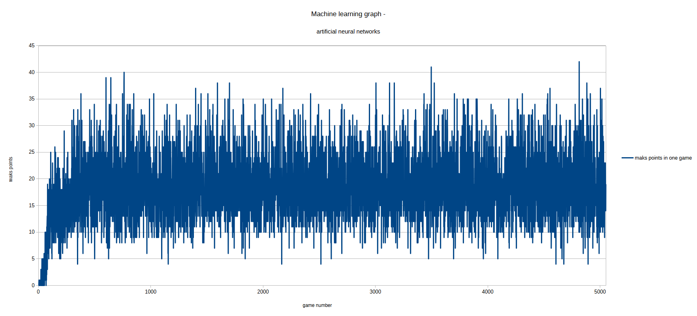

# SNAKE-DQN  🐍🤖  

# PROJECT DESCRIPTION
This is my first AI project in python. It features an autonomous agent that learns to 
play the classic Snake game using reinforcement learning (Deep Q-Learning). The agent starts with no knowledge of the game 
and improves its strategy over time by interacting with the environment that I created. 

# CORE TECHNOLOGIES
- Python: Main programming language.
- PyTorch: Used to build and train the Deep Q-Network.
- Pygame: Used for the game engine and visualization.
- NumPy: Used for efficient state representation and mathematical operations.

# HOW IT WORKS 
The project implements a Deep Q-Network (DQN) where:
- State: An 11-element vector representing the snake's surroundings (danger, direction, and food location).
- Model: A linear neural network with an input layer (11), a hidden layer (256), and an output layer (3).
- Actions: The agent can choose between three moves: [1, 0, 0] (Straight), [0, 1, 0] (Right Turn), or [0, 0, 1] (Left Turn).
- Reward System:
  - +10 for eating an apple.
  - -10 for a Game Over (hitting walls or itself).
  - Small positive/negative rewards based on whether it's getting closer to the food.

# PROJECT STRUCTURE 
- agent.py -> The "brain" of the snake, handling the training loop and memory.
- model.py -> Definition of the Neural Networkand the Trainer class.
- SnakeAI.py -> The game logic modified for AI interaction. 
- snake.py & board.py -> Core game components like position of snake body and creating game board. 

# RESULTS 
I made short analize, I catch how many points AI gets in every 5050 games 

As we see 

