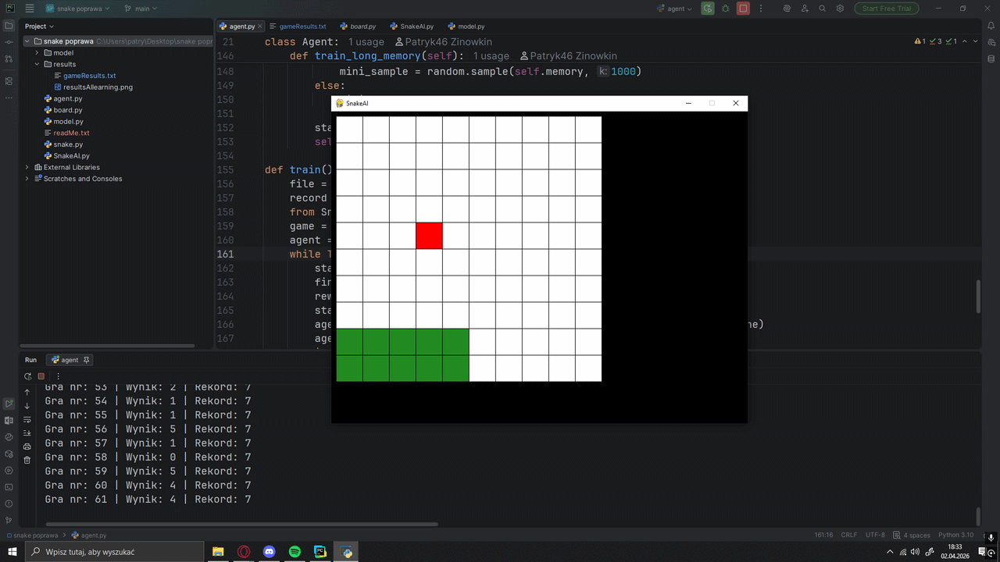

# SNAKE-DQN  🐍🤖  

# PROJECT DESCRIPTION
This is my first AI project in python. It features an autonomous agent that learns to 
play the classic Snake game using reinforcement learning (Deep Q-Learning). The agent starts with no knowledge of the game 
and improves its strategy over time by interacting with the environment that I created. 

# CORE TECHNOLOGIES
- Python: Main programming language.
- PyTorch: Used to build and train the Deep Q-Network.
- Pygame: Used for the game engine and visualization.
- NumPy: Used for efficient state representation and mathematical operations.
  
# REQUIREMENTS 
- torch
- pygame
- numpy
- python 3.10+
  
# HOW IT WORKS 
The project implements a Deep Q-Network (DQN) where:
- State: An 11-element vector representing the snake's surroundings (danger, direction, and food location).
- Model: A linear neural network with an input layer (11), a hidden layer (256), and an output layer (3).
- Actions: The agent can choose between three moves: [1, 0, 0] (Straight), [0, 1, 0] (Right Turn), or [0, 0, 1] (Left Turn).
- Reward System:
  - +10 for eating an apple.
  - -10 for a Game Over (hitting walls or itself).
  - Small positive/negative rewards based on whether it's getting closer to the food.

# HOW IT LOOKS LIKE 

# PROJECT STRUCTURE 
- agent.py -> The "brain" of the snake, handling the training loop and memory.
- model.py -> Definition of the Neural Network and the Trainer class.
- SnakeAI.py -> The game logic modified for AI interaction. 
- snake.py & board.py -> Core game components like position of snake body and creating game board. 

# RESULTS Analysis

Results Analysis
The graph shows the agent's performance over 5050 games.
- Initial Learning Phase (Games 0–500): You can observe a steep upward trend. The agent quickly moves from scoring 0 points to consistently hitting a range of 10–25 points as it learns the basic mechanics of moving toward the apple and avoiding walls.
- Stability and Exploration (Games 500–5000): After the initial spike, the scores stabilize. The high density of the lines indicates that the agent has developed a reliable strategy.
- Peak Performance: The agent reached a record score of over 40 points in a single game.
- Fluctuations: The occasional lower scores (dips) are likely caused by the epsilon-greedy strategy implemented in agent.py, where the agent sometimes takes random moves to explore new possibilities even after learning a good strategy.

# HOW TO USE
Firsly you have to install module such as numpy, torch, pygame
Secondly you need to run agent.py and that's all, you can enjoy watching how neural networks starts updating its weights and improving better performance.

Note: The model is automatically saved as model.pth in the /model folder every time a new high score is achieved.

